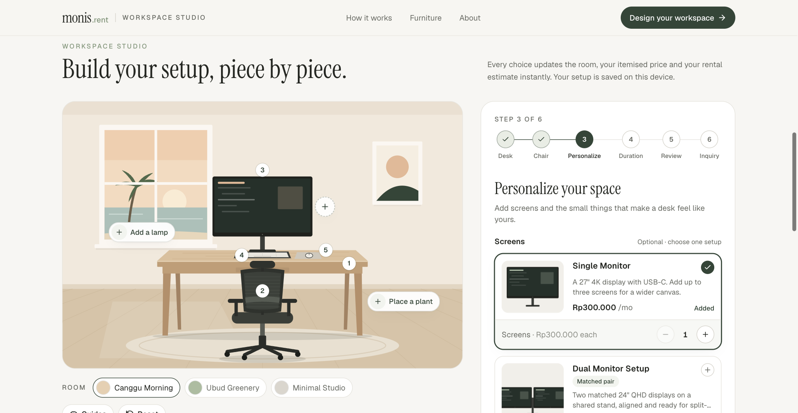
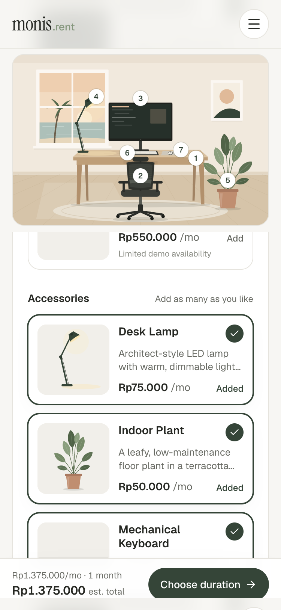
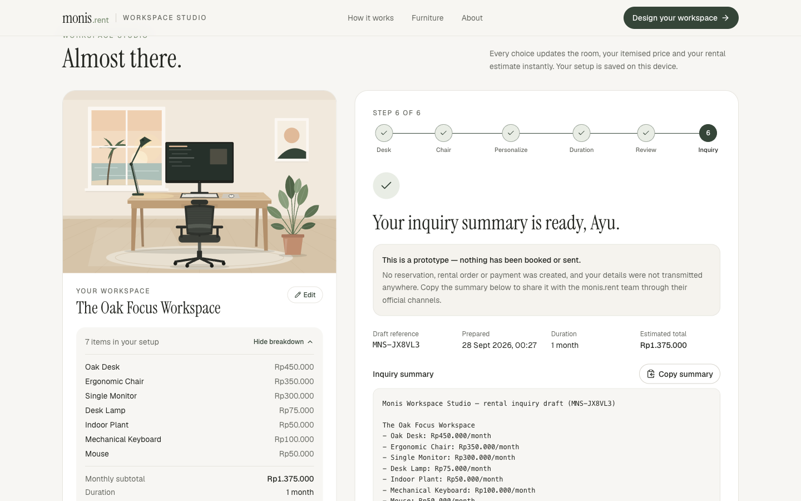
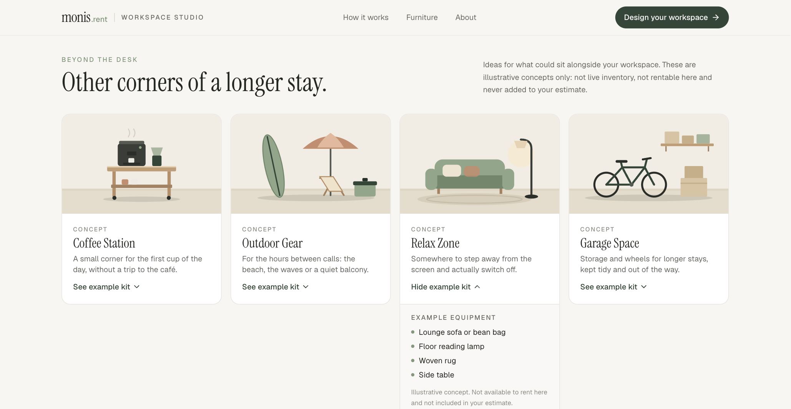

# Monis Workspace Studio

**Design your space. Rent your setup. Work from anywhere.**

An interactive workspace configurator prototype for [monis.rent](https://monis.rent), a furniture rental service for digital nomads, freelancers and startups in Bali. Visitors build a home-office setup piece by piece, watch it appear in a live illustrated room, see a transparent rental estimate, and prepare a rental inquiry — all on a single page.

Built for the **Desent Solutions developer challenge**.



> **Prototype notice.** Products, illustrations, prices and availability are illustrative. They are not live monis.rent inventory or official rental rates. The inquiry form is frontend-only: nothing is sent, booked, reserved or charged.

---

## The challenge

Renting furniture online usually means scrolling a product list and imagining the result. Workspace Studio flips that: you design the room first and understand the cost before reaching out. The goals were:

- make the preview the centerpiece, updating instantly with every choice;
- keep pricing honest and easy to follow (monthly subtotal × months, no invented discounts);
- guide users through a short, forgiving flow that works just as well on a phone;
- end in a useful, shareable inquiry summary without pretending an order was placed.

## Features

- **Live room preview** — layered SVG illustration of desk, chair, monitors (1–3 single screens or a matched pair), monitor arm, lamp, plant, keyboard and mouse, with subtle enter/exit motion.
- **Three room styles** — Canggu Morning, Ubud Greenery and Minimal Studio.
- **Numbered markers and legend** — each item in the room is numbered and listed in "In this room"; the **Guides** toggle hides markers and add buttons for a clean view.
- **Contextual room actions** — once a desk is placed, **Add a monitor**, **Add a lamp** and **Place a plant** buttons appear on the spots where those items will stand, and a round **+** beside single monitors adds another screen (up to 3). On phones the same actions become a compact **Quick add** toolbar under the preview, where each chip shows its current state and a second tap removes the item. Every action calls the same store actions as the product cards, so there are no duplicate selections and prices are identical.
- **Inviting empty state** — the empty room shows a softly pulsing outline of the desk with both desks offered right in the preview; once a desk is placed, a pulsing chair outline hints at the next step.
- **Beyond the desk** — an optional showcase below the studio with four illustrated concept categories (Coffee Station, Outdoor Gear, Relax Zone, Garage Space), each with an expandable example kit. They are clearly labelled as illustrative concepts, are not rentable and are never added to the estimate.
- **Guided six-step flow** — Desk → Chair → Personalize → Duration → Review → Inquiry, with a clickable stepper, locked steps until a desk and chair are chosen, and clear "why can't I continue" hints.
- **Transparent pricing** — itemised breakdown, monthly subtotal and estimated total for 1, 3, 6 or 12 months, formatted in IDR (e.g. `Rp1.750.000`).
- **Review screen** — every choice with an Edit shortcut plus the pricing assumptions.
- **Rental inquiry** — name, email, optional phone, delivery date, Bali area and address, notes and duration, with inline validation, an error summary and focus management.
- **Honest confirmation** — a draft reference and a copyable plain-text summary; the screen states plainly that nothing has been booked or sent.
- **Saved on this device** — the configuration persists in `localStorage` (validated on load; corrupt or tampered data falls back to defaults). Personal details are never persisted.
- **Reset** — two-tap confirmation clears everything back to an empty room.
- **Responsive** — sticky preview and bottom action bar on mobile, a two-column studio on desktop.
- **Accessible** — semantic landmarks, skip link, native radio groups, `aria-pressed` product cards, live-region announcements, visible focus styles, and `prefers-reduced-motion` support.

| Mobile | Inquiry confirmation |
| --- | --- |
|  |  |



## Tech stack

| Concern | Choice |
| --- | --- |
| Framework | **Next.js 16** (App Router, TypeScript, Turbopack) |
| Styling | **Tailwind CSS v4** with design tokens in `src/app/globals.css` |
| State | Zustand (with `persist` middleware) |
| Motion | Framer Motion (respects reduced motion) |
| Icons | lucide-react |
| Tests | Vitest |
| Hosting | **Vercel** (zero-config) |

No UI kit (Bootstrap, MUI, etc.) is used — every component is built with Tailwind utilities.

## Getting started

Requirements: Node.js 20.9 or newer (developed on Node 22) and npm.

```bash
npm install
npm run dev
```

Open [http://localhost:3000](http://localhost:3000).

### Scripts

| Command | What it does |
| --- | --- |
| `npm run dev` | Start the development server |
| `npm run build` | Create a production build |
| `npm run start` | Serve the production build |
| `npm run lint` | Run ESLint |
| `npm run typecheck` | Run the TypeScript compiler without emitting |
| `npm test` | Run the Vitest unit tests |
| `npm run generate:images` | Regenerate `public/products/*.svg` thumbnails from the scene illustrations |

## Project structure

```
src/
  app/                  App Router entry: layout, page, global styles and tokens
  components/
    home/               Hero, How it works, Beyond the desk, About
    layout/             Header, Footer, Logo
    workspace/          Configurator, preview, stepper, product cards, price summary
      illustrations/    SVG scene parts (backdrop, desks, chairs, monitors, accessories, concept vignettes)
    checkout/           Inquiry form, checkout summary, confirmation
  data/                 Product catalog, concept categories, durations, Bali delivery areas, room scenes
  hooks/                Store hydration, derived summary, step navigation, quick actions
  lib/                  Pure logic: pricing, validation, steps, quick actions, sanitising, inquiry text
  store/                Zustand store with persistence
  types/                Shared TypeScript types
scripts/                Thumbnail generator
public/products/        Generated product thumbnails
public/screenshots/     README screenshots
```

## Architecture decisions

- **One source of truth for artwork.** The room preview and product thumbnails are drawn from the same SVG components on a shared 1200×800 canvas. Thumbnails are cropped views rendered to static files by `scripts/generate-product-images.tsx`, so products always match what appears in the room and there are no third-party image licences to worry about.
- **Pure, tested business logic.** Pricing, validation, step rules and storage sanitising live in `src/lib` as plain functions with no React dependency, which keeps components thin and makes the rules easy to unit test.
- **Derived, not duplicated, state.** The store holds only the raw configuration and UI state. Line items, totals, the workspace title and form errors are derived on render, so they can never drift out of sync.
- **Contextual actions are views, not a second cart.** `src/lib/quick-actions.ts` derives each action's state (placed, status label) and the existing store command it maps to (`toggleMonitor` or `toggleAccessory`) from the current configuration. The room buttons, mobile toolbar and product cards all read and write the same store.
- **Concepts stay outside the catalog.** The "Beyond the desk" categories live in their own data module with no prices, so they cannot enter line items or totals.
- **Hydration-safe persistence.** The store uses `skipHydration` and rehydrates in an effect after mount, so server and client render identical markup. Persisted data goes through `sanitizeConfiguration`, which drops unknown ids, clamps quantities and falls back to defaults. Only the configuration is saved — never personal details.
- **Static by default.** The page prerenders as static HTML; interactivity is limited to the configurator island. There are no API routes, secrets or environment variables.
- **Honest prototype boundaries.** The inquiry creates a local draft summary only. Copy throughout the UI makes clear that prices are illustrative and nothing is booked.

## Pricing model

All prices are illustrative monthly rates in IDR:

| Item | Monthly |
| --- | --- |
| Oak Desk | Rp450.000 |
| Studio Desk (sit-stand) | Rp550.000 |
| Ergonomic Chair | Rp350.000 |
| Minimal Chair | Rp250.000 |
| Single Monitor (up to 3) | Rp300.000 each |
| Dual Monitor Setup | Rp550.000 |
| Desk Lamp | Rp75.000 |
| Indoor Plant | Rp50.000 |
| Mechanical Keyboard | Rp100.000 |
| Mouse | Rp50.000 |
| Monitor Arm | Rp75.000 |

**Estimated total = monthly subtotal × rental months.** No discounts, deposits, delivery fees or taxes are applied. Example: Studio Desk, Ergonomic Chair, Dual Monitor Setup, Desk Lamp, Mechanical Keyboard, Mouse and Monitor Arm is Rp1.750.000/month, or Rp10.500.000 for 6 months.

## Testing and quality checks

- **Unit tests (Vitest):** 51 tests across pricing, configuration sanitising, inquiry helpers, validation, step rules, store actions (switching, toggling, quantity clamping, reset, persistence and tampered or corrupted storage) and quick actions (state, no-duplicate add/remove through the store, identical pricing, button placement).
- **Lint and types:** `npm run lint` and `npm run typecheck` pass with no warnings.
- **Production build:** `npm run build` succeeds; `/` is prerendered as static content.
- **Manual browser QA:** these journeys were run in a browser against the dev server:
  - **A.** Build a basic setup — the preview, legend and prices update live.
  - **B.** Change the desk, remove an item and pick 6 months — the totals recalculate correctly.
  - **C.** Submit the inquiry empty, with invalid values, then with valid values — validation, focus handling and the non-committal confirmation all behave as expected.
  - **D.** Reset — everything returns to defaults, including saved state.
  - **Contextual actions:** placing a desk from the empty room, adding a monitor, extra screens, a lamp and a plant from the room and the mobile toolbar, and removing them again. The product cards, legend and totals stay in sync, and the Guides toggle hides the buttons.
  - **Widths:** 320, 375, 768, 1024 and 1440 px, with no horizontal overflow.
- **Security:** Snyk Code static analysis reported 0 issues. `npm audit` reported 0 vulnerabilities.

## Deploying to Vercel

The project needs no environment variables or custom configuration.

**Option A — Dashboard**

1. Push this repository to GitHub.
2. In [Vercel](https://vercel.com/new), choose **Add New → Project** and import the repository.
3. Keep the detected defaults: framework **Next.js**, build command `next build`, install command `npm install`.
4. Click **Deploy**. Vercel will give you a `*.vercel.app` URL.

**Option B — CLI**

```bash
npx vercel login
npx vercel          # preview deployment
npx vercel --prod   # production deployment
```

## Submitting to Desent

1. Create a GitHub repository and push:

   ```bash
   git remote add origin git@github.com:<your-username>/monis-workspace-studio.git
   git push -u origin main
   ```

2. Add **`desent-bot`** as a collaborator:
   - **Web:** open the repository → **Settings → Collaborators** (or **Collaborators and teams**) → **Add people** → search for `desent-bot` → choose the permission level (Read is enough to review) → send the invitation.
   - **CLI (GitHub CLI):**

     ```bash
     gh api -X PUT repos/<your-username>/monis-workspace-studio/collaborators/desent-bot -f permission=pull
     ```

   The collaborator is only added once `desent-bot` accepts the invitation. You can confirm it under **Settings → Collaborators**, or with `gh api repos/<your-username>/monis-workspace-studio/collaborators/desent-bot` (this returns HTTP 204 once accepted).
3. Deploy to Vercel (see above) and share the repository URL and the live URL with Desent.

## Known limitations

- Catalog, prices, availability and product descriptions are illustrative, not live monis.rent data.
- The inquiry is not transmitted anywhere; there is no backend, email, CRM, payment or booking integration.
- "Limited demo availability" labels are static examples, not real stock levels.
- Delivery fees, deposits, taxes and multi-month discounts are intentionally not modelled.
- The configuration is saved per browser via `localStorage` and is not synced across devices.
- The interface is English-only; prices use Indonesian number formatting.
- Automated tests cover the logic layer; UI journeys were verified manually rather than with an end-to-end test suite.
